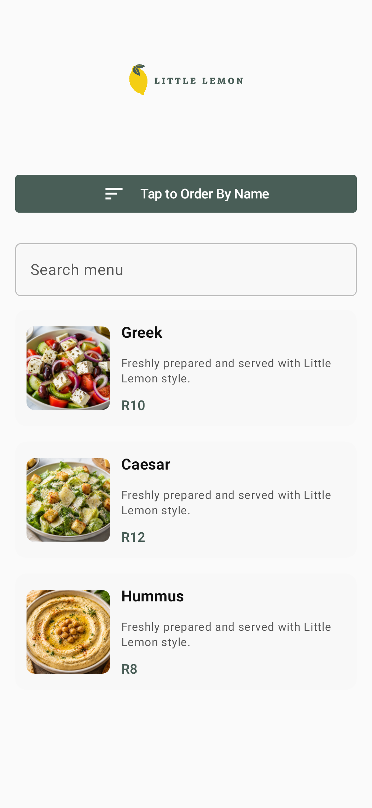
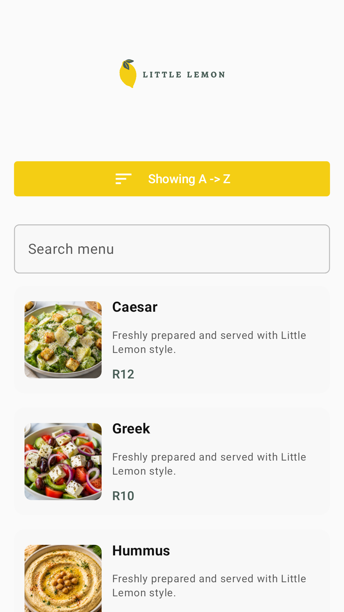
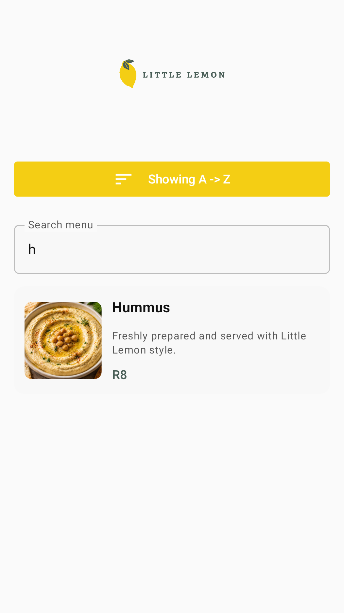
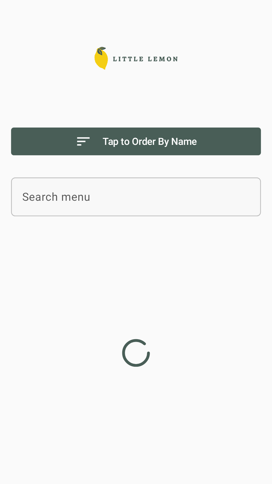

# 🍋 Little Lemon Menu App

A modern Android app built with Jetpack Compose that displays a restaurant menu with search, sorting, and smooth UI performance.

## 📸 Screenshots

### Home Screen

## Features
- Search menu items by name
- Sort menu items (A → Z)
- Custom reusable Compose components
- Smooth scrolling with optimized images
- Offline-ready architecture with Room
- MVVM architecture
- Dependency Injection

## Tech Stack
- Kotlin
- Jetpack Compose
- Hilt
- Room
- Ktor
- StateFlow / Flow
- Material 3